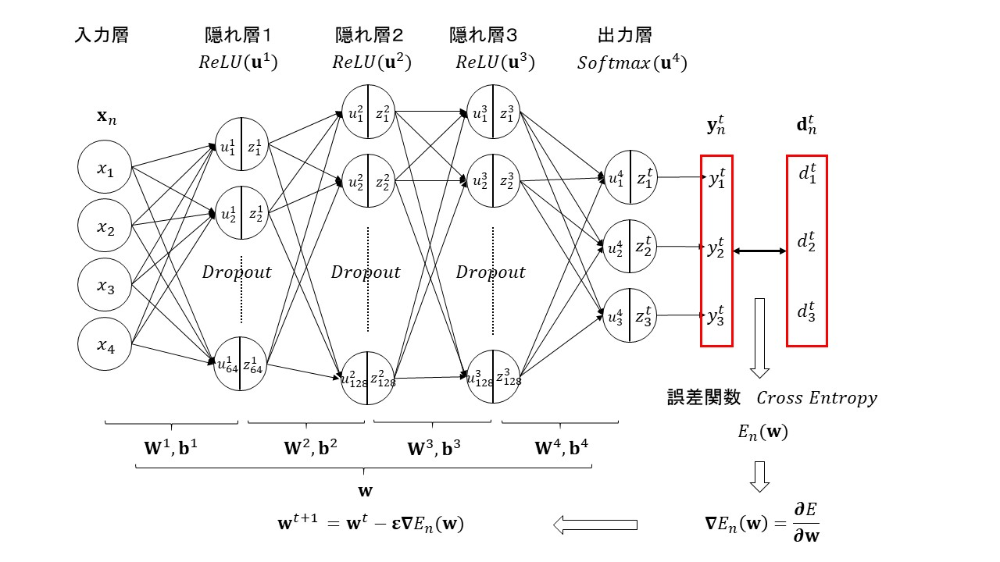

# iris-study
IRIS classification with Nueral Network

ソースコード: iris.ipynb

## 1. iris-study の目的
* iris-study は、Deep Learning における Nueral Network 作成に関するレポートである
* iris-study は、DL用のフレームワークやライブラリを使わずに作成
* sklearn の IRIS Dataset を用いて、iris の雄しべと雌しべの長さと幅から種類を予測する
* 使用データ
    * 入力データ: ['sepal length (cm)', 'sepal width (cm)', 'petal length (cm)', 'petal width (cm)']
    * 出力データ:  ['setosa', 'versicolor', 'virginica']

## 2. Nueral Network の構成
### 2.1 トポロジー
+ 入力層
+ 隠れ層１
    + 64 Nodes
    + ドロップアウト１
    + 活性化関数(ReLU)    
+ 隠れ層２
    + 128 Ndoes
    + ドロップアウト２
    + 活性化関数(ReLU)    
+ 隠れ層３
    + 128 Nodese
    + ドロップアウト３
    + 活性化関数(ReLU)
+ 出力層
    + 活性化関数(Softmax)

### 2.2 パラメーター
* 学習データ: 120
* テストデータ: 30
* バッチサイズ: 40
* 繰り返し: 1,000 iteration x 10 データセット
* 誤差関数:　クロスエントロピー
* 重みの初期値設定:  He
* 学習率最適化手法: Adam
* 学習率: 0.001
* L2正則化
* ドロップアウト: 0.4

## 3. ニューラルネットワークの構造図

[事前に用意する情報]

入力: 

訓練データ: 

[多層ネットワークのパラメータ]

重み:   

バイアス:

活性化関数: 

中間層出力: 

総入力: 

出力: 

誤差関数: 

## 4. 結果

## 5. 主な関数

<dl>
    <dt>relu(x)</dt>
    <dd>ReLU関数</dd>
    <dt>softmax(x)</dt>
    <dd>ソフトマックス関数</dd>
    <dt>d_relu(x)</dt>
    <dd>ReLU関数の導関数</dd>
    <dt>d_softmax_with_loss(x)</dt>
    <dd>ソフトマックスとクロスエントロピーの複合導関数</dd>
    <dt>cross_entropy_error(d, y)</dt>
    <dd>クロスエントロピー関数</dd>
    <dt>accuracy(d, y)</dt>
    <dd>精度計算</dd>
    <dt>init_network()</dt>
    <dd>ネットワークの重みとバイアスの初期値設定 (He)</dd>
    <dt>Dropout</dt>
    <dd>ドロップアウトのクラス</dd>
    <dd>メソッド 
        &nbsp;&nbsp;&nbsp;&nbsp;forward(x, train_flg) 
        &nbsp;&nbsp;&nbsp;&nbsp;backward(dout)
    </dd>
    <dt>forward(network, x, train_flg)</dt>
    <dd>ネットワークの順伝搬</dd>
    <dt>backward(x, d, z1, z2, z3, y, dropout)</dt>
    <dd>ネットワークの誤差逆伝搬</dd>
</dl>
