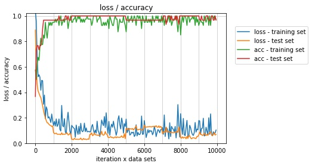

# iris-study
IRIS classification with Nueral Network

$\LaTeX$

## 1. iris-study の目的
* iris-study は、Deep Learning における Nueral Network 作成に関するレポートである
* iris-study は、DL用のフレームワークやライブラリを使わずに作成
* sklearn の IRIS Dataset を用いて、iris の雄しべと雌しべの長さと幅から種類を予測する
* 使用データ
    * 入力データ ['sepal length (cm)', 'sepal width (cm)', 'petal length (cm)', 'petal width (cm)']
    * 出力データ ['setosa', 'versicolor', 'virginica']

## 2. Nueral Network の構成
### 2.1 トポロジー
+ 入力層
+ 隠れ層１
    + 64 Nodes
    + ドロップアウト１
    + 活性化関数(ReLU)    
+ 隠れ層２
    + 128 Ndoes
    + ドロップアウト２
    + 活性化関数(ReLU)    
+ 隠れ層３
    + 128 Nodese
    + ドロップアウト３
    + 活性化関数(ReLU)
+ 出力層
    + 活性化関数(Softmax)

### 2.2 パラメーター
* 学習データ 120
* テストデータ 30
* バッチサイズ 40
* 誤差関数　クロスエントロピー
* 重みの初期値設定  He
* 学習率最適化手法 Adam
* 学習率 0.001
* L2正則化
* ドロップアウト 0.4

## 3. ニューラルネットワークの構造図
[事前に用意する情報]

入力: $x_n = [x_{n1} .. x_{nl}]$

訓練データ: $d_n = [d_{n1} .. d_{nk}]$

[多層ネットワークのパラメータ]
$$
重み: w^l = \left[
    \begin{array}{rrr}
      w^l_{11} & .. & w^l_{1l} \\
      : & .. & : \\
      w^l_{j1} & .. & w^1_{jl}
    \end{array}\right] \\
バイアス: b^l = \left[\begin{array}{rrr} b^l_1 .. b^l_j\end{array}\right]
$$
活性化関数: $f^l(u^l) = [f^l(u^l_1) .. f^l(u^l_j)]$

中間層出力: $z^l = [z^l .. z^k] = f^l(u^l)$

総入力: $u^l = W^l_{(l-1)}$

## 4. 主な関数

<dl>
    <dt>relu(x)</dt>
    <dd>ReLU関数</dd>
    <dt>softmax(x)</dt>
    <dd>ソフトマックス関数</dd>
    <dt>d_relu(x)</dt>
    <dd>ReLU関数の導関数</dd>
    <dt>d_softmax_with_loss(x)</dt>
    <dd>ソフトマックスとクロスエントロピーの複合導関数</dd>
    <dt>cross_entropy_error(d, y)</dt>
    <dd>クロスエントロピー関数</dd>
    <dt>accuracy(d, y)</dt>
    <dd>精度計算</dd>
    <dt>init_network()</dt>
    <dd>ネットワークの重みとバイアスの初期値設定 (He)</dd>
    <dt>Dropout</dt>
    <dd>ドロップアウトのクラス</dd>
    <dd>メソッド 
        &nbsp;&nbsp;&nbsp;&nbsp;forward(x, train_flg) 
        &nbsp;&nbsp;&nbsp;&nbsp;backward(dout)
    </dd>
    <dt>forward(network, x, train_flg)</dt>
    <dd>ネットワークの順伝搬</dd>
    <dt>backward(x, d, z1, z2, z3, y, dropout)</dt>
    <dd>ネットワークの誤差逆伝搬</dd>
</dl>

## 5. 結果

